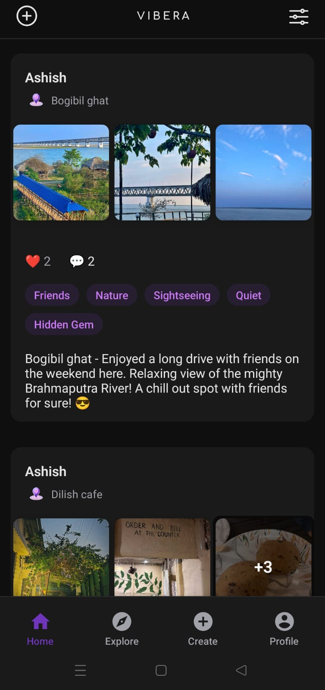
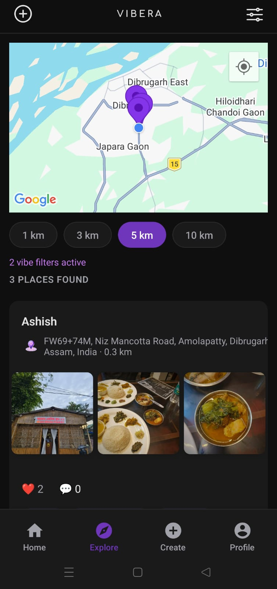
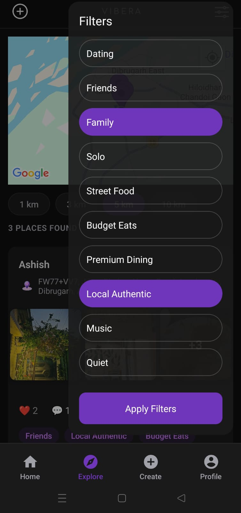
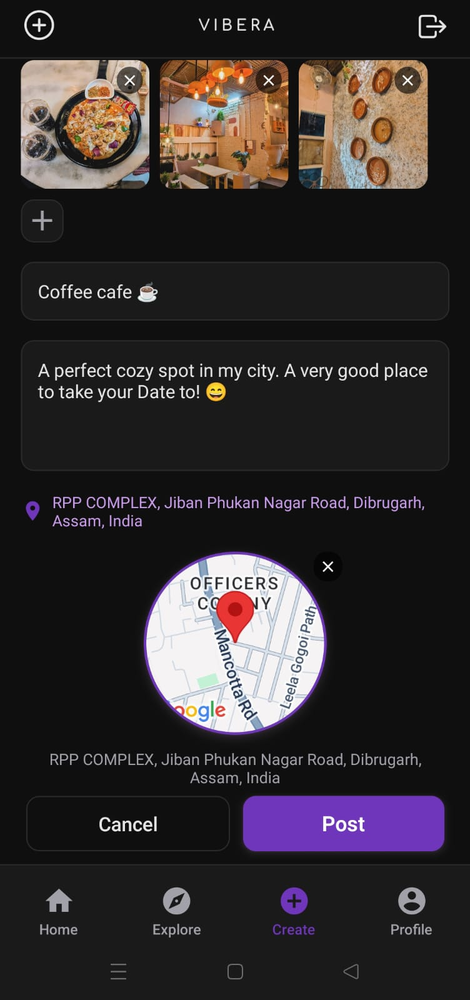

# Vibera 🌍✨

Discover places based on vibes, not ratings.

Vibera is a social discovery app where people share experiences of local places based on the *vibe*.

Instead of relying on ratings alone, Vibera helps users explore places through emotions, atmosphere, and real human experiences.

---

## 🎯 Core Idea

Every place has a vibe.

Vibera allows users to:
- Share their experiences
- Let AI understand the vibe of that experience
- Help others discover places that match their mood

---

## 🤖 AI-Powered Vibe Detection

When a user creates a post:
- The description is sent to OpenAI
- AI analyzes the text
- Relevant vibes are automatically assigned

This removes manual tagging and ensures more accurate and meaningful categorization.

---

## 🔍 Smart Discovery

Users can:
- Search within distance (1km / 3km / 5km / 10km)
- Filter by specific vibes
- Discover the **most liked and engaging places** for that vibe

Each result includes:
- Exact location
- User experiences
- Engagement signals (likes, comments)

---

## 📍 Example Use Case

> Want a quiet, romantic place nearby?

→ Filter: `ROMANTIC + QUIET`  
→ Distance: `3km`  
→ Vibera shows top places based on real experiences  

---

## 🚀 Features

- 📸 Post local experiences with images
- 🤖 AI-generated vibe tagging
- ❤️ Like & comment system
- 💬 Comment system with replies (Instagram-style single thread)
- 📍 Location-based filtering
- 🔍 Vibe-based search
- 🔐 JWT Authentication

---

## 📸 Screenshots

### Home Feed

### Explore Nearby

### Vibe Filters (AI-powered)

### Post Details & Engagement

### Create Experience

## 🛠 Tech Stack

### Mobile
- React Native (Expo)

### Backend
- Node.js
- Express
- Prisma ORM
- PostgreSQL

### Services
- OpenAI API (AI vibe detection)
- Cloudinary (image uploads)

---

## ⚙️ Setup

### Backend
cd backend
npm install
npx prisma migrate dev
npm run dev

### Mobile
cd mobile
npm install
npm start
